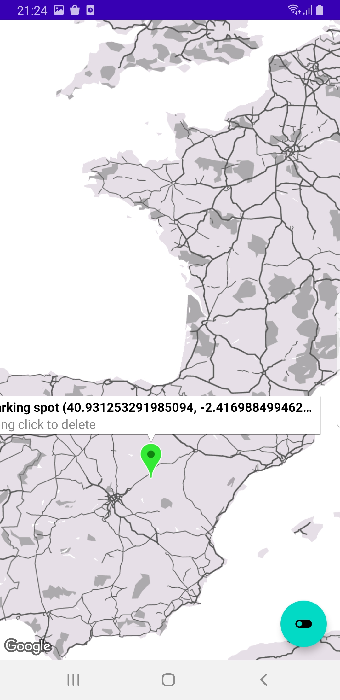

# ParkingSpot-Finder
App that opens a google map and allows to pin parking spots

## The Brief

App that allows user to select a spot on the map and mark it as a parking spot

## Architecture & Libraries
    - MVVM
    - ROOM Database
    - Dependency Injection - Dagger-Hilt
    - Kotlin Coroutines
    - Flow
    - Google Maps

## App preview:

Image #1            |  Image #2             |  Image #3            |  Image #4      
:-------------------------:|:----------------------------:|:----------------------------:|:----------------------------:
    |       |    |   

